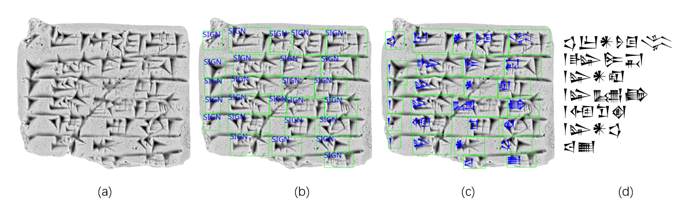

## ABOUT  
Computer Vision coursework project in Ecole polytechnique.  
Author: MENG Yanxu, ZOU Yuran.  

## GOAL
Detection, Classification and Transcription on Sumerian tablets.

## REPORT
You can read the report [HERE](Report_CV.pdf).

## DATA
1. First you need to download the HeiCuBeDa image dataset:
https://heidata.uni-heidelberg.de/file.xhtml?persistentId=doi:10.11588/DATA/IE8CCN/X6APKT&version=2.0  
and put the contents into HeiCuBeDa folder.  
You should make sure that the path becomes:  
```
(root of project)   
└── HeiCuBeDa   
    ├── Images_MSII_Filter   
    │   └── ...   
    └── HeiCuBeDa_B_Hilprecht_Database_240121.json   
```
2. The annotations in MaiCuBeDa are already in this github repository. No download required.  
```all_photo_anno.json, train_photo_anno.json, test_photo_json```: bbox annotation of each photo. Each bbox has a "charname" and a "transliteration".  
```charname_to_id.json, transliteration_to_id.json```: established dict mapping textual categories to int.


## DEMO


*A sample result.*  
*(a) An input image; (b) Sign detection; (c) Sign detection and classification; (d) Transcription.*

## TRAINING AND EVALUATION
1. Run ```playgrounds/prepare_data.ipynb``` to prepare the data into json. 
2. Run ```playgrounds/make_yaml_dataset.ipynb``` to make YOLO-friendly yaml dataset. Specify the desired version of dataset (is_sign, unicode, charname, unicode_topN, charname_topN) in the 4th cell.
3. Prepare an environment equipped with torch, and then ```pip install ultralytics```
4. Run ```3_YOLO_ultra/train.ipynb```. Remember to use the correct yaml dataset that you just created.  
The full 70-epoch training takes about 4 hours on my RTX 3060.
5. mAP Evaluation is included in the ```train.ipynb```.   
To evaluate CER, use eval_CER.ipynb on the json file under ```3_YOLO_ultra/run/detect/``` that step 4 just created.

## NOTES
1. Code for all failed attempts (Qwen, Donut, TrOCR, DeTR,...) are not included in this repository.